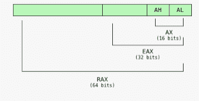
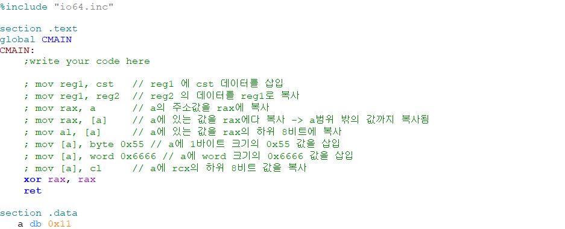
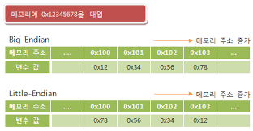
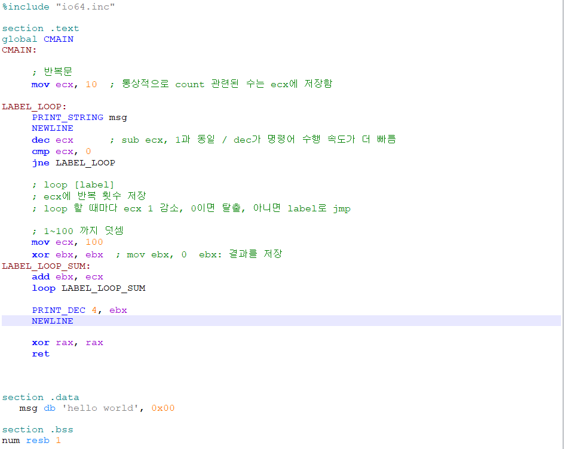

# 어셈블리 언어 입문

## 범용 레지스터 

다양한 목적으로 사용되는 레지스터 들이 존재하지만 일반적으로 프로그래밍시 rax, rbx, rcx, rdx 종류를 사용한다

 

## 범용 레지스터 구조

 

* RAX: 전체 64비트 
* EAX: RAX의 하위 32비트
* AX: EAX의 하위 16비트
* AH: AX의 상위 8비트
* AL: AX의 하위 8비트

 

### 메모리 구조

메모리의 data 영역은 초기화 된 데이터를 올려두고 bss 영역에는 초기화 되지 않은 데이터를 올려둔다.
 * 주로 data 영역을 사용한다

초기화 된 데이터 
> 변수이름  크기 초기값
> * 크기: db(byte), dw(word), dd(dword), dq(qword)

초기화 되지 않은 데이터
> 변수이름 크기 개수
> * 크기: resb(byte), resw(word), resd(dword), resq(qword)

 

### 레지스터 연산 

  

## 엔디안

빅 엔디안
> 입력 0x1234이 들어오면 0x12, 0x34로 저장   
> 숫자 비교에 유리

리틀 엔디안
> 입력 0x1234이 들어오면 0x34, 0x12로 저장   
> 캐스팅에 유리하다

 

## 사칙 연산

### 덧셈, 뺄셈

### 곱셈, 나눗셈

 

## 분기문 (if)
특정 조건에 따라서 코드 흐름을 제어하는 것
> ex) 스킬 버튼 눌렀는가? YES -> 스킬 사용   
> ex) 제한 시간 내에 던전 입장 수락 버튼을 눌렀는가? YES -> 입장, NO -> 던전 취소

 

 

## 반복문 
특정 조건을 만족할때까지 반복해서 실행
> ex) Hello World를 10번 출력해야 한다면?

 

## 함수
프로시저(procedure), 서브루틴(subroutine)이라고도 부른다.
> 특정 기능을 수행하기 위한 영역

### **`하지만 함수에 전달하는 인자가 많으면 어떻게 할까?`**
> eax, ebx에 이미 중요한 값이 있으면 ?   
> .data .bss 사용하면 ?
> * 인자를 도대체 몇개를 할당해야 할까?

위와 같은 문제점이 발생하기 때문에 다른 메모리 구조가 필요하다
 * 함수가 실행하는 동안에는 유지시켜주어야 함 
 * 함수가 끝나면 정리 가능 
 * 함수 내에서 또 다른 함수를 호출 가능 

 

### 스택(stack) 이라는 메모리 영역을 사용
함수가 사용하는 일종의 메모장 역할
> * 매개 변수 전달
> * 복귀 할 주소 관리 등등 

