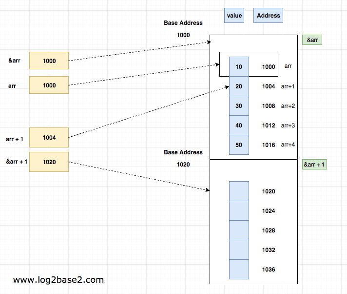

# 배열 
배열은 같은 자료형의 변수를 일렬로 늘어놓은 형태이다.

<details>
  <summary> <b>참고</summary>
  <div markdown="0">
  <a href = "https://github.com/jonghyeok98/CS-Study/blob/main/contents/data-structure/Data_Sturcture.md">배열</a>
  </div>
</details>

<br>

TYPE 이름 [길이]
``` cpp
int Array[10];

const int Count = 10;  // #define Count = 10 으로도 사용할 수 있다
int Monster[Count];    // 배열의 크기는 상수여야 한다
```

<br>

> 배열의 이름은 곧 배열의 `시작 주소`이다
> * 정확히는 시작 위치를 가리키는 `TYPE *` 포인터
---

<br>

## 포인터 VS 배열

<br>

배열을 포인터라고 알고 있거나 배열의 이름이 포인터 혹은 포인터 상수라고 알고 있는 경우가 많다   
하지만 놀랍게도 `배열은 포인터가 아니다`

<br>

``` cpp
int arr[3];       // arr은 3개의 int형 데이터를 담을 수 있는 메모리 공간이 있다
arr[2] = 1;       // 그리고 우리는 배열의 인덱스를 통해 값을 할당할 수 있다

int * ptr;        // ptr은 3개의 int형 데이터를 담을 공간이 없다
                  // 단지 int의 메모리 주소를 가리킬 수 있다
ptr = &arr[0];
ptr = arr;        // 위 두 코드는 동일하다
```
> arr에 저장된 int 데이터들을 ptr에 복사한다는 의미는 아니다

 * 배열의 이름 즉, arr이 배열의 첫 원소의 주소를 가리키는 포인터로 `변환`되어 작동한다
 * arr[i]가 의미하는 듯은 포인터 arr부터 시작해서 arr이 가리키는 것보다 i 원소만큼 이동해서 값을 가져오라는 뜻이다

<br>

### ***배열을 포인터로 나타낼 수 있는 이유는 C와 C++의 `Decay` 정책에 의해 가능하다***
> `Decay`란 암시적으로 배열이 포인터로 변환되는 과정에서 배열의 타입과 크기를 잃어버리는 것

<br>

### 포인터
 * 주소를 가지고 있는 변수
 * 포인터의 크기: 메모리 주소의 크기
 * 배열에 대한 포인터는 배열이 가르키는 길이를 모른다
 * `sizeof` 연산자: 포인터가 담고있는 메모리 주소의 크기
 * `&` 연산자: TYPE * 타입

 <br>

### 배열
 * 같은 자료형의 연속적인 데이터 모음
 * 배열의 크기: TYPE 크기 x 배열의 길이
 * 고정 배열은 배열이 가르키는 길이를 알고 있다
 * `sizeof` 연산자: 배열의 전체 크기 
 * `&` 연산자: TYEP * [배열 길이]


<br>

``` cpp
int arr[3] = {};
int * p = arr;

cout << "p : " << p << endl;            // 주소 값 반환
cout << "typeof p : " << typeid(p).name() << endl << endl;     // int * 
 
cout << "&arr : " << &arr << endl;      // 주소 값 반환 
cout << "typeof &arr : " << typeid(&arr).name() << endl;       // int (*)[3]
```

<br>



> 배열의 이름 arr이 배열의 시작 원소를 가리킨다면 &arr은 배열 자체를 가리키는 포인터

 * arr + 1: Int형 변수의 크기(4)만큼 증가
 * &arr +1: 전체 배열의 크기(12)만큼 증가

<br>

### ***따라서 `sizeof`와 `&`연산자에 배열의 이름이 사용된다면 배열의 이름은 다수의 데이터를 저장하는 배열 그 자체일 뿐이다***


<br>

C++은 배열 구문을 사용하여 매개변수를 포인터 구문으로 변환한다
``` cpp
void print(int array[]);
void print(int * array);  
// 두 함수의 선언은 동일하다
```
> 매개변수를 사용용도에 맞게 지정해주면 된다