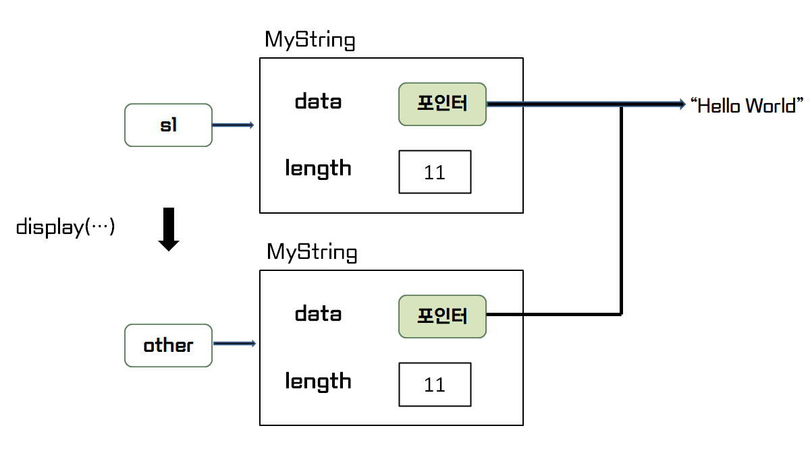
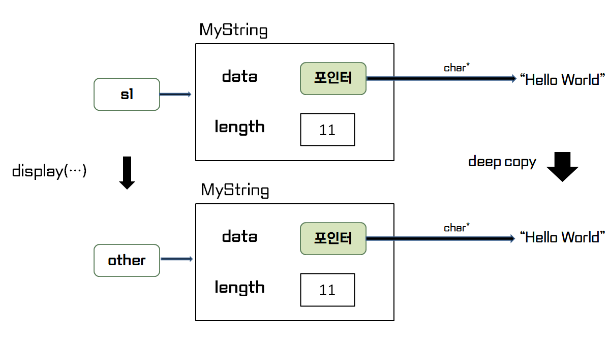

# 얕은 복사와 깊은 복사

<br>

``` cpp
class Pet
{
    Pet()
    {
        cout << "Pet()" << endl;
    }
    ~ Pet()
    {
        cout << "~Pet()" << endl;
    }
    Pet(const Pet& pet)
    {
        cout << "Pet(const Pet&)" << endl;
    }
};

class RabbitPet : public Pet
{

};

class Knight
{
public:
    int _hp = 100;
    // Pet _pet;      Pet을 상속받은 RabbitPet을 가지려면 타입을 바꾸어야 한다
    Pet* _pet;        // 포인터 혹은 참조값을 가지고 있으면 타입 변환을 통해 상속받은 
                      // 다른 클래스도 가질 수 있다
};

Knight knight;        // 기본 생성자
knight._hp = 200;

knight knight2 = knight    // 복사 생성자
// knight knight2(knight)  // 복사 생성자, 위와 동일하다

knight knight3;        // 기본 생성자
knight3 = knight;      // 복사 대입 연산자 
```

---
<br>

## 얕은 복사(Shallow Copy)
> 변수가 가리키는 실제 데이터가 아닌 `메모리 주소를 복사`하여 변수의 데이터로 만드는 방법

<br>



<br>

### ***객체의 디폴트 복사 생성자 또한 얕은 복사로 이루어진다***

<br>

``` cpp
class Knight
{
public:
    Knight()
    {
        cout << "Knight()" << endl;
        _pet = new Pet();
    };
    // knight(const Knight& knight)
    // {
    //     cout << "Knight(const Knight&)" << endl;
    // };
    ~ Knight()
    {  
        cout << "~ Knight()" << endl;
        delete _pet;
    };
};

Knight knight;
Knight knight2;

knight = knight2;      // 디폴트 복사 생성자 호출 (얕은 복사)
```
> 얕은 복사로 인해 knight와 knight2의 _pet은 같은 메모리 주소를 가르키고 있다

 * knight와 knight의 소멸자가 호출되면서 같은 _pet을 두 번 할당 해제하는 문제가 발생


---
<br>


## 깊은 복사(Deep Copy)
> 변수가 관리하는 리소스 자체를 복사하여 `메모리를 할당`하는 방법

<br>



<br>


``` cpp
class Knight
{
public:
    Knight()
    {
        cout << "Knight()" << endl;
        _pet = new Pet();
    };
    knight(const Knight& knight)               // 복사 생성자 (깊은 복사)
    {
        cout << "Knight(const Knight&)" << endl;
        _hp = knight._hp;
        _pet = new Pet(*knight._pet)      // 깊은 복사
    };
    knight& operator=(const Knight& knight)
    {
        _hp = knight._hp;
        _pet = new Pet(*knight._pet);           // 깊은 복사
        return *this;
    }
    ~ Knight()
    {  
        cout << "~ Knight()" << endl;
        delete pet;
    };
public:
};

Knight knight;
Knight knight2;

knight = knight2;      // 디폴트 복사 생성자 호출 (얕은 복사)
```
> 깊은 복사로 인해 knight의 _pet은 같은 데이터를 새로운 메모리에 할당하여 복사되었다

* knight와 knight의 소멸자가 호출되면서 다른 _pet을 각각 할당 해제

---
<br>

### 디폴트 복사 생성자
 * 부모 클래스의 복사 생성자 호출
 * 멤버 클래스의 복사 생성자 호출
 * 멤버가 기본 타입일 경우 메모리 복사 -> `얕은 복사`

<br>

### 사용자 정의 복사 생성자 
 * 부모 클래스의 기본 생성자 호출
 * 멤버 클래스의 기본 생성자 호출

<br>

``` cpp
Knight(const Knight& knight) : Player(knight){}
```
> 복사 생성자에서 부모/멤버 클래스의 복사 생성자를 호출하고 싶으면 명시적으로 호출해주어야 한다

<br>

### 디폴트 복사 대입 연산자
 * 부모 클래스의 복사 대입 연산자 호출
 * 멤버 클래스의 복사 대입 연산자 호출
 * 멤버가 기본 타입일 경우 메모리 복사 -> `얕은 복사`

<br>

### 사용자 정의 복사 대입 연산자
 * 전부 사용자가 지정해주어야 한다

<br>

``` cpp
Knight& operator=(const Knight& knight)
{
    Player::operator=(knight);   // 부모 클래스의 복사 대입 연산자
    _pet = knight._pet;          // 멤버 클래스의 복사 대입 연산자
    return *this;
}
```
> 복사 대입 연산자에서 부모/멤버 클래스의 복사 대입 연산자를 호출하고 싶으면 명시적으로 호출해주어야 한다
