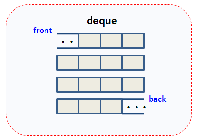

# Deque(Double Ended Queue) 덱
> vector의 단점을 보완하기 위해 만들어진 배열 기반 컨테이너이다

 * 연속으로 메모리를 할당하는 벡터와는 다르게 `여러개의 메모리 블록을 할당`하고 하나의 블록처럼 여기는 기능을 제공한다
 * 메모리가 부족할 때마다 일정한 크기의 새로운 메모리 블록을 할당한다

 <br>



 * 벡터와 다르게 앞쪽에서도 원소를 추가, 제거할 수 있다
 * 중간 삽입, 삭제에서 벡터에 비해 효율이 약간 더 우수하다
 * push_back을 통해 원소를 추가하는 경우 Deque가 더 효율적이다
> push_back을 통해 원소를 추가하는 과정에서도 벡터는 용량이 가득찰 경우 이 전의 메모리를
삭제하고 원소를 복사한 후 메모리를 재할당하는 방식이지만 Deque는 단순히 메모리 블럭을 하나 새로 할당한다

<br>

### Deque의 선언과 생성자
> deque<TYPE> 변수이름

``` cpp
deque<int> dq1;          // 비어있는 deque 

deque<int> dq2(5);       // 0으로 초기화된 크기가 5인 deque

deque<int> dq3(5, 10);   // 10으로 초기화된 크기가 5인 deque

deque<int> dq4(d3);      // dq3를 복사 -> 복사생성자

dq2[3];                  // idx를 통해서 임의접근이 가능하다
```

<br>

### 데이터 삽입, 삭제
``` cpp
dq.push_front();        // dq의 첫 번째 원소 앞에 데이터 삽입
dq.push_back();         // dq의 마지막 원소 뒤에 데이터 삽입

dq.pop_front();         // dq의 첫 번째 원소 제거
dq.pop_back();          // dq의 마지막 원소 제거

dq.insert(3, 4);        // 3번째 위치에 4삽입, 삽입한 곳의 iterator 반환

dq.erase(iter)          // iter가 가르키는 원소 제거, 제거한 곳의 iterator 반환
```

