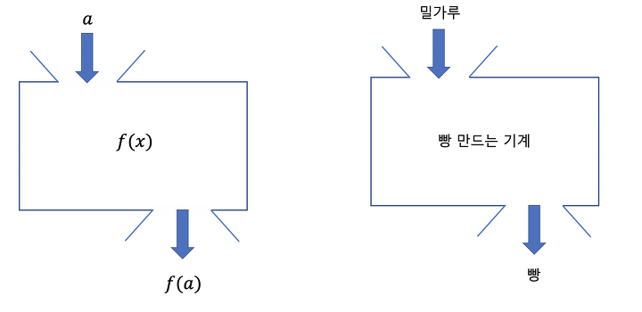
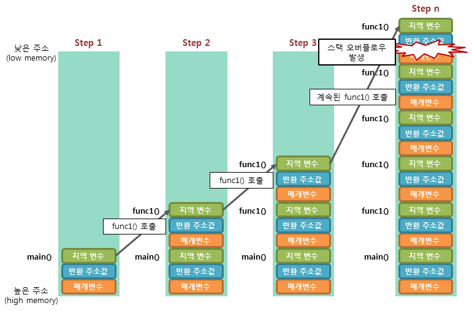

# 함수

<br>

## 함수(프로시저, 메소드, 루틴)

<br>



 * 입력에 대한 어떤 상호작용으로 인해 출력이 나오게 된다.

<br>

``` cpp
// input으로 무엇을 받고 output으로 무엇을 반환할지 정해주어야 한다

// [반환 타입] [함수 이름]([ 인자 타입 매개 변수])
// {
//     함수 내용 

//     return 반환 값
// }

#include<iostream>

using namespace std;

// Hello World를 콘솔에 출력하는 함수를 만들어보자 !
// input: 없음 / output : 없음 
// 인자타입: int, float, double, char, void 등등

void PrintHelloWorld()
{
    cout << "Hello World" << endl;
}

// 정수를 입력 받아서 출력하는 함수를 만들어보자 !
// input: int // output :없음 

void PrintNumber(int number)
{
    cout << "넘겨주신 숫자는" << number << "입니다" << endl;
}

// 2를 곱하고 결과물을 뱉는 함수를 만들어보자 !
// input: int // output: int

int MultiplyBy2(int a)
{
    int b = a * 2;
    return b;
}

// 두 숫자를 곱해서 결과물을 뱉는 함수를 만들어 보자 !
// input: int, int / output: int

int MultiplyBy(int a, int b)
{
    int c = a * b ;
    return c
}

int main(int argc, char * argv[])
{
    int a = 3 ;
    int b = 5;
    int result = MultiplyBy(a, b);
    // PrintHelloWorld();
    // int reuslt = MultiplyBy2(3);
    // PrintNumber(result);

    return 0;
}
```

---

<br>

## 스택 프레임

<br>



<br>

## 지역 변수와 값 전달

<br>

### 전역 변수
> 프로그램이 시작될 때 생성되어 data 영역에 저장되며 프로그램 전체에서 사용 가능하며 프로그램이 종료되면 소멸된다

 * 초기화 여부, const 등에 따라서 .rodata .data .bss 로 나뉜다

<br>

### 지역 변수
> 함수 내부에서 생성되어 스택에 저장되며 선언된 함수 내부에서 사용되고 함수가 종료되면 소멸된다

<br>

## 호출 스택


<br>

``` cpp
# include<iostream>

using namespace std;

// 함수 선언
// void Func1();
// void Func2(int a, int b);
// void Func3(float a);


void Func1()
{
    cout << "func1" << endl;

    Func2(1, 2);              // Func2를 아직 못찾음
}

void Func2(int a, int b)
{
    cout << "func2" << endl;
    
    Func3(10);                // Func3를 아직 못찾음
}

void Func3(float a)
{
    cout << "func3" << endl;
}

int main(int argc, char * argv [])
{
    Func1();

    return 0;
}

```

<br>

> 해결책으로는 

1. 함수의 위치를 바꾼다 -> 순서를 생각해서 배치해야되기 때문에 비효율적이다.
2. 함수의 선언과 정의를 통해 해결한다. 

<br>

### ***디버거의 `호출 스택`을 통해서 스택의 반환 주소값을 참조해서 어떤 경로를 통해 함수가 실행되었는지 알 수 있다***
---

<br>

## 함수 마무리 

<br>


### 함수 오버로딩
> 같은 이름의 함수를 다른 인자를 사용하여 중복 정의한 것

 * 하나의 함수명에 인자를 어떻게 사용하느냐에 따라서 비슷하지만 약간씩 다른 다양한 기능을 제공

다음 중 하나를 만족하면 오버로딩이 가능하다
1. 매개변수 갯수가 다르거나
2. 매개변수 타입이 다르거나 (순서가 다른것도 포함) 

<br>

### ***매개변수는 같고 반환형식만 다른것은 오버로딩 할 수 없다***

<br>

### 예시
``` cpp
int Add(int a, int b)
{
    int result = a + b;
    return result;
}

float Add(int a, float b)
{
    float result = a + b;
    return result;
}
```

<br>


### 디폴트 매개변수
> 매개변수의 기본 값을 정해주는 것으로 매개변수를 전달받지 않아도 기본 값으로 작동하게 된다

 * 디폴트 매개변수는 매개변수의 중간에 존재하면 안되고 가장 오른쪽에 위치해있어야 한다 

<br>

### 예시
``` cpp
int Add(int a, int b, int c = 0)
{
    int result = a + b + c;
    return result;
}
```

<br>


