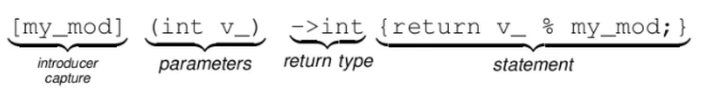

# 람다 (Lambda)
> 일반 함수에서 함수 이름이 없어지고 동작만 있는 함수

 * 함수 객체를 빠르게 만드는 문법이다

<br>

### 람다의 정의


<br>

### [캡처](매개 변수){함수 동작}(호출 인자)
* []: 캡처 (introducer capture): 함수 내부 객체에 변수를 저장하는 개념과 유사하다
* (): 인자 (parameters) 매개변수 선언 부분 (생략 가능)
* ->: 반환 타입 (return type) (생략 가능)
* {}: 함수의 몸체 (statement)
* (): 함수 호출 시 인자 (생략 가능)

<br>

### 람다 표현식
> 주로 `[] () {}`의 형태이다

``` cpp
[my_mod](int v_) -> int{return v_ % my_mod;}    // 람다 표현식

// 다음의 함수를 람다 표현식으로 바꿀 수 있다
bool operator()(Item& item)
{
    return item._itemId == _itemid;
}
// [캡처](매개 변수){함수 몸체}
// 값 복사 방식(=), 참조 방식(&)
// defalut는 값 복사 방식
int itemId = 4;
auto findByItemIdLambda = [](Item& item){ return item._itemId == itemId; };

// 다양한 람다 표현식의 활용
auto itFind = find_if(v.begin(), v.end(), [](int n) {return ((n % 11) == 0);});
v.erase(remove_if(v.begin(), v.end(), [](int n){return ((n % 2) == 0);}), v.end());
```

 * 런타임시 이름은 없지만 메모리 상에 임시적으로 존재하는 클로저(Closure) 객체가 생성된다
> `클로저`란 람다에 의해 만들어진 실행시점 객체이다

<br>

### ***캡처 종류는 값 복사 방식 `=`과 참조 방식 `&`이 있으며 default는 값 복사 방식이다***
 * 변수마다 캡처 모드를 지정해서 사용이 가능하다 `추천`

<br>

``` cpp
int itemId = 4;
Rarity rarity = Rarity::Unique;
ItemType type = Itemtype::Weapon;

auto findByItemIdLambda = [&itemId, rarity, type](Item& item)
{
     return item._itemId == itemId && item._rarity == rarity && item._type == type;
};
```
> 참조 방식 `&` 으로 전달하는 것은 해당 참조 값이 유효함을 보장해주어야 한다

<br>

### ***하지만 모두 복사 방식으로 전달해준다고 꼭 안전한 것은 아니다***
``` cpp
class Knight
{
public:
    auto ResetHpJob()
    {
        // auto f = [=]()
        // {
        //     _hp = 200;
        //     복사 방식 = 이라면 
        //     this->_hp; 를 뜻한다
        // };
        auto f = [this]()
        {
            this->_hp = 200;
            // 복사 방식 = 이라면 
            // this->_hp; 를 뜻한다
        };
        return f;
    }
public:
    int _hp = 100;
};

Knight* k = new Knight();
auto job = k->ResetHpJob();     // 함수 객체
delete k;                       // k 소멸
job();                          // 유효하지 않은 주소에 접근으로 인한 메모리 오염 !
```

<br>


### ***람다를 사용하기 어렵다면 `[] () {}`를 먼저 작성해두고 채워나가보자 !***