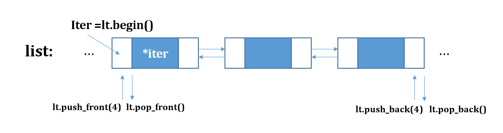

# List
> STL의 시퀀스 컨테이너(Sequence container)의 일종으로 `노드 기반` 컨테이너이다

 * 이중 연결리스트(double linked list)의 구조를 가지고있다
 * vector, deque와는 다르게 멤버 함수에서 정렬(sort, merge), 이어붙이기(splice)가 있다
 * 원소 탐색 시 반복자(at(), [])를 통한 임의접근이 불가능하고 양방향 반복자(++, --)를 이용해서 탐색한다
 * vector와는 다르게 중간 원소에 대한 삽입, 삭제가 용이하다

<br>

### 이중 연결리스트 구조


<br>

### 리스트의 선언과 생성자
> 선언은 list<TYPE> 변수 이름 으로 사용한다

``` cpp
list<int> li;     // 비어있는 list 컨테이너 생성

list<int> li2(10);   // defalut(0)로 초기화된 원소 10개를 가진 list 생성

list<int> li3(3, 2); // 2로 초기화된 원소 3개를 가진 list 생성

list<int> li4(li2);  // li2를 li4로 복사 -> 복사생성자
```
<br>

## list의 멤버 함수

<br>

### 데이터 삽입
```cpp
list<int> li;
for (int i = 0; i < 100; i++)
    li.push_back(i);      // 리스트의 뒤에 삽입
// li.push_front();       // 리스트의 앞에 삽입

// 삽입한 원소를 가리키는 iterator 반환
li.insert(iter, value);  // iter 위치에 value 삽입
```

<br>

### 리스트의 크기 반환
```cpp
int size = li.size();     // 리스트의 크기 반환
```
<br>

### 데이터 삭제 및 반환

``` cpp
int first = li.front();              // 첫 번째 원소 반환, 참조
int last = li.back();                // 마지막 원소 반환, 참조

li.pop_front();              // 첫 번째 원소 제거
li.pop_back();               // 마지막 원소 제거

// 삭제한 원소의 다음 원소를 가르키는 iterator 반환
li.erase(iter);              // iter 위치의 원소 제거

li.remove(10);               // value와 같은 원소를 모두 삭제
```
 
<br>

### 리스트의 반복자
``` cpp
list<int>::iterator itBegin = li.begin();  // 시작 원소의 iterator 반환
list<int>::iterator itEnd = li.end();  // 마지막 원소의 다음 원소(더미)의 iterator 반환

// 반복자를 이용한 리스트 순환
for (list<int>::iterator it = li.begint(); it != li.end(); ++it )
{
    cout << *it << endl;
}
```
<br>

### 리스트 구현해보기
```cpp
template<typename T>
class Node
{
public:
    Node() : _next(nullptr), _prev(nullptr), _data(T())
    {

    }

    Node(const T& value) : _next(nullptr), _prev(nullptr), _data(value)
    {

    }
public:
    Node* _next;      // 다음 노드를 가르킴
    Node* _prev;      // 이전 노드를 가르킴
    T _data;
};

template<typename T>
class Iterator
{
public:
    Iterator() : _node(nullptr)
    {

    }

    Iterator(Node<T>* node) : _node(node)
    {

    }

    Iterator& operator++()
    {
        _node = _node->_next;
        return *this;
    }

    Iterator operator++(int)
    {
        Iterator<T> temp = *this;
        _node = _node->_next;
        return temp;
    }

    Iterator& operator--()
    {
        _node = _node->_prev;
        return *this;
    }

    Iterator operator--(int)
    {
        Iterator<T> temp = *this;
        _node = _node->_prev;
        return temp;
    }

    T& operator*()
    {
        return _node->_data;
    }

    bool operator==(const Iterator& right)
    {
        return _node == right._node;
    }

    bool operator!=(const Iterator& right)
    {
        return _node != right._node;
    }
public:
    Node<T>* _node;
};

template<typename T>
class List
{
public:
    List() : _size(0)
    {
        _header = new Node<T>();
        _header->_next = _header;
        _header->_prev = _header;
    }

    ~List()
    {
        while(_size > 0)
            pop_back();

        delete _header;
    }

    // [1] <-> [2] <-> [3] <-> [header] <->
    // [1] <-> [2] <-> [3] <-> [4] <-> [header] <->
    void push_back(const T& value)
    {
        AddNode(_header, value);
    }

    // [1] <-> [2] <-> [before] <-> [4] <-> [header] <->
    // [1] <-> [2] <-> [before] <-> [header] <->
    void pop_back()
    {
        RemoveNode(_header->_prev);
    }

    // [1] <-> [2] <-> [before] <-> [4] <-> [header] <->
    // [1] <-> [2] <-> [node] <-> [before] <-> [4] <-> [header] <->
    Node<T>* AddNode(Node<T>* before, const T& value)
    {
        Node<T>* node = new Node<T>(value);

        Node<T>* prevNode = before->_prev;
        prevNode->_next = node;
        node->_prev = prevNode;

        node->_next = before;
        before->_prev = node;

        _size++;
        return node;
    }

    // [1] <-> [prevNode] <-> [node] <-> [nextNode] <-> [header] <->
    // [1] <-> [prevNode] <-> [nextNode] <-> [header] <->
    Node<T>* RemoveNode(Node<T>* node)
    {
        Node<T>* prevNode = node->_prev;
        Node<T>* nextNode = node->_next;

        prevNode->_next = nextNode;
        nextNode->_prev = prevNode;

        delete node;
        _size--;
        return nextNode;
    }

    int size() {return _size;}
public:
    typedef Iterator<T> iterator;

    iterator begin(){return iterator(_header->_next);}
    iterator end(){return iterator(_header);}

    iterator insert(iterator it, const T& value)
    {
        Node<T>* node = AddNode(it._node, value);
        return iterator(node);
    }

    iterator erase(iterator it)
    {
        Node<T>* node = RemoveNode(it._node);
        return iterator(node);
    }
public:
    Node<T>* _header;
    int _size;
};
```
