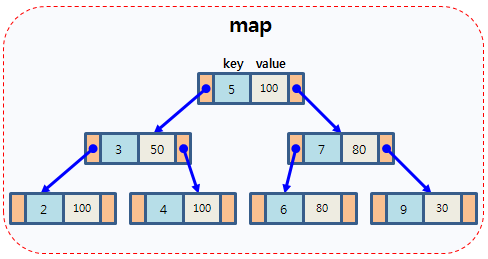
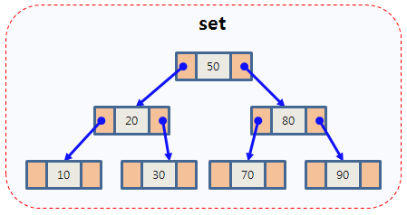

# Map과 Set
> 연관 컨테이너(Associative Container)로 Key와 Value로 이루어져있다

<br>

## Map
> Map은 각 노드가 `Key와 Value`의 쌍으로 이루어진 자가 균형 이진트리이다

 * `중복을 허용하지 않고` 탐색, 삽입, 삭제가 O(logn)인 RBT(Red Black Tree)이다 
 * (first, second)로 이루어진 pair 객체로 저장되며 first-key, second-value로 매핑된다
 * 자료를 저장할 때 자동으로 내부에서 key를 기준으로 `오름차순으로 정렬`한다

<br>



<br>

### Map 선언과 생성자
> map<key TYPE, value TYPE> 변수이름

``` cpp
map<int, int> m;     // 기본 선언 방법

map<int, int> m2(m1);     // m1을 m2에 복사 -> 복사생성자
```

<br>

### 데이터 삽입, 삭제
``` cpp
map<int, int> m;
// 플레이어 1만명 추가
for(int i = 0; i < 10000; i++)
{
    m.insert(pair<int, int>(i, i*100));     // 성공시 true 실패시 false 반환
}

for(int i = 0; i < 5000; i++)
{
    int randomValue = rand() % 5000;
    m.erase(randomValue);           // key를 사용한 원소 삭제
}

m.erase(m.begin()+2);       // 특정 위치의 원소 삭제
m.erase(m.begin(), m.end());    // begin부터 end까지 범위의 모든 원소 삭제
m.clear();                  // 모든 원소 삭제
```

 * map에 데이터를 삽입하는 insert는 key와 value가 쌍을 이루기 때문에 pair 객체를 인자로 받아야한다
 * insert 성공시 true, 실패시 false를 반환한다
 
<br>

## Pair
> 서로 연관된 2개의 데이터를 한 쌍으로 묶어서 다루기 위한 클래스

 * STL에서 `데이터 쌍`을 표현하기 위해 사용된다

<br>

### Pair 클래스의 형태
```cpp
template<typename T1, typename T2>struct pair;

pair<int ,int> p;      // int 타입 한 쌍의 데이터를 가지고있는 pair 객체 선언

p.first;        // 첫 번째 인자(Key)에 대한 접근

p.second;       // 두 번째 인자(Value)에 대한 접근

make_pair(value1, value2)   // value1과 value2를 한 쌍으로 하는 pair 객체를 만들어서 반환
```

 * T1: first로 주로 Key를 저장한다
 * T2: second로 주로 value를 저장한다

<br>

### 데이터 검색
```cpp
// 반복문을 이용한 map의 순회
for(map<int, int>::iterator it = m.begin(); it != m.end(); ++it)
{
    int key = it->first;
    int value = it->second;
    cout << key << " " << value << endl;
}

// 데이터 검색 후 있으면 수정 없으면 추가하기
map<int, int>::iterator findIt = m.find(1000);
if(findIt != m.end())
{
    findIt->second = 200;
}
else
{
    m.insert(make_pair(1000,1000))
}

// 위의 코드를 idx를 통해서 간편하게 작성할 수 있다
m[5] = 500;       

// [] 연산자 사용할 때 주의
// 대입을 하지 않더라도 (Key/Value) 형태의 데이터가 추가된다
for(int i = 0; i < 10; i++)
{
    cout << m[i] <<> endl;
}

// 단순히 데이터 검색 시 find를 사용하는 것이 좋고
// defalut 상태로 key, value가 추가되도 상관없으면 idx를 통해 접근해도 된다
```

<br>

## Set
> 노드 기반 컨테이너로 자가 균형 이진트리로 구현되어 있다

 * (Key, Value)로 구성된 Map과는 다르게 Key로만 구성되어 있다
 * 중복을 허용하지 않고 Key는 오름차순으로 정렬된다

<br>



<br>

### Set 선언과 생성자
> set<key TYPE> 변수이름

``` cpp
set<int> s;     // 기본 선언 방법

set<int> m2(m1);     // m1을 m2에 복사 -> 복사생성자
```

<br>

### ***Map의 멤버 함수와 동일하게 동작한다***

<br>

## Multimap, MultiSet
> map과 set에서 key의 중복을 허용하는 노드 기반의 연관 컨테이너로 자가 균형 이진트리다

 * idx를 통한 임의접근이 불가능해 insert를 통해서만 데이터 삽입이 가능하다

<br>

### multimap의 검색과 순회
``` cpp
multimap<int, int> mm;

pair<multimap<int, int>::iterator, multimap<int, int>::iterator> itPair;
itPair = mm.equal_range(1);     // 1의 key를 갖는 시작과 마지막 범위의 iterator 반환

for(multimap<int, int>::iterator it = itPair.first; it != itPair.second; ++it)
{
    cout << it->first << " " << it->second << endl;
}

multimap<int, int>::iterator itBegin = mm.lower_bound(1);      // 첫 번째 1의 iterator 반환
multimap<int, int>::iterator itEnd = mm.upper_bound(1);        // 마지막 1의 iterator 반환

for(multimap<int, int>::iterator it = itbegin; it != itEnd; ++it)
{
    cout << it->first << " " << it->second << endl;
}
```

<br>

### Multiset의 검색과 순회
``` cpp
multiset<int> ms;

pair<multiset<int>::iterator, multiset<int>::iterator> itPair;
itPair = ms.equal_range(1);   // 1의 key를 갖는 시작과 마지막 범위의 iterator 반환

for(multiset<int, int>::iterator it = itPair.first; it != itPair.second; ++it)
{
    cout << it->first << " " << it->second << endl;
}

multiset<int>::iterator itBegin = ms.lower_bound(1);      // 첫 번째 1의 iterator 반환
multiset<int>::iterator itEnd = ms.upper_bound(1);        // 마지막 1의 iterator 반환

for(multiset<int>::iterator it = itbegin; it != itEnd; ++it)
{
    cout << it->first << " " << it->second << endl;
}
```