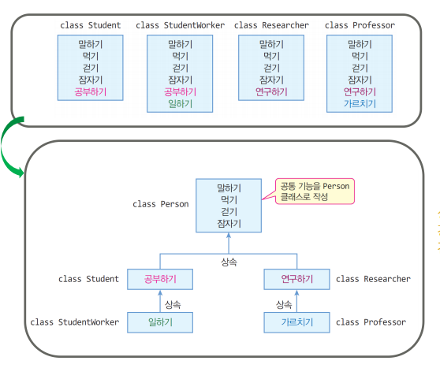

# 객체지향 프로그래밍(OOP)

<br>

## OOP(Object Oriented Programming)
객체지향 프로그래밍은 컴퓨터 프로그래밍 패러다임 중 하나로
> 프로그래밍에서 필요한 데이터를 `추상화`시켜 `상태`와 `책임(행동)`을 가진 `객체`를 만들고 그 객체들 간의 `협력`을 통해 객체간의 조화를 이루며 적극적으로 상호작용하는 협력적인 객체를 창조하는 것이다

<br>

<details>
  <summary> <b>참고</summary>
  <div markdown="0">
  <a href = "https://github.com/jonghyeok98/ReadingRecord/tree/main/contents/%EA%B0%9D%EC%B2%B4%EC%A7%80%ED%96%A5%EC%9D%98%20%EC%82%AC%EC%8B%A4%EA%B3%BC%20%EC%98%A4%ED%95%B4">OOP</a>
  </div>
</details>

---
<br>

## 생성자
> C++ 에서 생성자(Constructer)를 통해 객체를 생성함과 동시에 멤버 변수를 초기화 할 수 있다

 * 클래스 이름과 동일한 이름으로 구현된다

<br>

### 생성자의 특징
1. 생성자는 반환값이 없다
2. 생성잔는 오버로딩 될 수 있다

<br>

### 기본 생성자
``` cpp
class Knight
{
public:           
    int _hp;        
    int _attack;
    int _posX;
    int _posY; 
public:
    Knight()                   // 기본 생성자
    {
        cout << "Knight() 기본 생성자 호출" << endl;
        _hp = 100;
        _attack = 10;
        _posX = 0;
        _posY = 0;
    }
    Knight(int hp)                   // 기타 매개변수를 받는 생성자
    {
        cout << "Knight() 기본 생성자 호출" << endl;
        _hp = hp;         // 받아온 매개변수로 초기화
        _attack = 10;
        _posX = 0;
        _posY = 0;
    }
}
```
<br>

* 팀에 따라 mHp, m_hp 등으로 매개변수를 구분하도록 작성한다
* `기본 생성자`는 매개 변수를 가지지 않으며 별도로 지정하지 않으면
* `디폴트 생성자`가 멤버 변수를 0, NULL 등으로 초기화 한다

<br>

### ***명시적으로 생성자를 `하나`라도 만들면 디폴트 생성자는 호출되지 않는다***

<br>

### 복사 생성자
> 일반적으로 `같은 데이터를 지닌` 객체를 생성할 때 사용된다

 * 자기 자신의 클래스와 동일한 참조 타입을 인자로 받는다
 * 동적 할당의 경우 깊은 복사가 이루어지도록 해주어야한다

``` cpp
Knight(const Knight& knight)
{
    _hp = knight.hp;
    _attack = knight.attack;
    _posX = knight._posX;
    _posY = knight._posY;
}
```
---
<br>

## 소멸자
> 객체의 수명이 끝났을 때 객체를 제거하기 위한 목적으로 사용된다
> * 객체의 수명이 끝났을 때 자동으로 컴파일러가 소멸자 함수를 호출한다

 * 클래스명과 동일하며 `~` 기호를 사용한다
 * 동적 할당이 이루어졌을 경우 이 때 함께 해제한다

 ``` cpp
 ~Kinght()
 {
    cout << "Knight() 소멸자 호출" << endl;
 }
 ```
---
<br>

## 클래스 상속
> 자식 클래스(Child Class)가 부모 클래스(Parent Class)의 속성을 그대로 물려받아 사용하는 것

<br>



<br>

### 상속
``` cpp
class Player
{
public:
    Player()
    {
        cout << "Player() 생성자 호출" << endl;
    }
    Player(int hp)
    {
        cout << "Player(int hp) 생성자 호출" << endl;
    }
    ~ Player()
    {
        cout << "Player() 소멸자 호출" << endl;
    }
	void Move() { cout << "Player Move 호출" << endl; }
	void Attack() { cout << "Player Attack 호출" << endl; }
	void Die() { cout << "Player Die 호출" << endl; }
	
public:
	int _hp;
	int _attack;
	int _defence;

};

class Knight : public Player
{
public:
    Knight()           // : Player(100) -> Player(int hp)의 생성자 호출
    // 선처리 영역
    // 부모 클래스의 생성자가 호출된다
    {
        cout << "Knight() 생성자 호출" << endl;
    }
    Knight(int stamina)
    {
        cout << "Knight(int stamina) 생성자 호출" << endl;
    }
    ~ Knight()
    {
        cout << "Knight() 소멸자 호출" << endl;
    }
    // 후처리 영역
    // 부모 클래스의 소멸자가 호출된다

    // 함수 재정의(overriding)
	void Move() { cout << "Knight Move 호출" << endl; }
public:
    int _stamina;
};

class Mage : public Player
{
public:
    int _mp;
};
```

> 위와 같이 상속을 사용할 수 있으며 상속받은 자식 클래스는 부모 클래스의 속성을 사용할 수 있다.

 * 자식 클래스는 상속받은 부모 클래스의 속성 + 자기 자신의 속성을 가지게 된다
 * 오버라이딩을 통해 부모 클래스에서 이미 정의된 함수를 재정의하여 사용할 수 있다
 * 오버라이딩을 적용한 함수의 원형은 기존의 함수와 동일한 매개변수를 전달 받는다

---
<br>

## 데이터 은닉과 캡슐화
> 객체가 구현된 방식의 세부 정보를 사용자로부터 숨기면서 유지하는 방식으로 사용자는 객체의 공개 인터페이스를 통해 접근할 수 있도록 하는 방식

<br>

현실 세계의 리모컨을 예로 들어보자
> 이 리모컨에는 버튼과 휠 등의 TV를 조작할 수 있는 인터페이스(interface)를 제공하지만 우리는 리모컨의 내부가 어떻게 설계되었는지, 내부에서 어떻게 동작하는지 알 필요는 없다.

<br>

### ***인터페이스와 구현의 분리는 리모컨의 작동 방식을 이해하지 않아도 리모컨을 사용할 수 있기때문에 매우 유용하다***

<br>

캡슐화된 클래스의 예시로 `std::string`, `std::cout` 등이 있다.
> 우리는 해당 라이브러리의 클래스가 어떻게 구현되었는지 몰라도 사용할 수 있다.

<br>

### ***이렇듯 `캡슐화`는 클래스는 사용하기 쉽고 프로그램의 복잡성을 줄여준다***
> 캡슐화란 연관된 데이터와 함수를 논리적으로 묶어놓은 것이다

<br>

일반적으로 클래스의 멤버 변수(구현 세부 정보)는 `private`로 설정하고, 멤버 함수(공개 인터페이스)는 `public`으로 설정한다

### 접근 지정자
> 데이터에 대한 접근 권한을 지정하는 선언

1. public: `공개적인`이라는 뜻으로 클래스 `외부`에서 접근할 수 있다
2. protected: public과 private의 중간으로 클래스 외부에서는 접근할 수 없지만 해당 클래스를 상속받은 `자식 클래스`에서는 접근할 수 있다
3. private: `사적인`이라는 뜻으로 클래스 `내부`에서만 접근할 수 있다

<br>

### 상속 접근 지정자
> 상속을 받을때 부모 클래스의 접근 지정자를 어떻게 받아올 것인지에 대한 선언

1. public: public -> public, protected -> protected, private -> private
2. protected: public -> protected, protected -> protected, private -> private
3. private: public -> private, protected -> private, private -> private
> 데이터에 대한 접근이 더 엄격한? 접근 지정자로 덮어쓰기 된다. 

---
<br>


## 다형성


---
<br>


## 연산자 오버로딩


---
<br>


