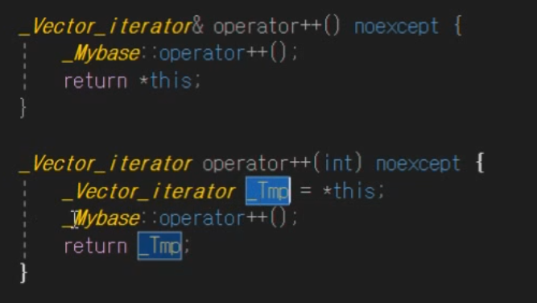

# STL(Standard Template Library)

C++을 위한 라이브러리로서 대표적으로 입출력 라이브러리(iostream 등), 시간 관련 라이브러리(chrono), 정규표현식 라이브러리(regex)등이 있지만 STL을 일컫는다면 다음과 같은 세 개의 라이브러리들을 의미한다
> STL은 프로그래밍할 때 필요한 자료구조, 알고리즘들을 템플릿으로 제공하는 라이브러리이다

<br>

### ***크게 3가지로 컨테이너, 반복자, 알고리즘이 있다***

<br>

## 1. 컨테이너(Container): 
> 컨테이너는 임의 타입의 객체를 보관할 수 있다

 * 데이터를 저장하는 객체로 자료구조를 의미한다

<br>

### 시퀀스 컨테이너(Sequence Container)
> 배열처럼 객체들을 순차적으로 보관한다

 * `Vector`, `List`, `Deque` 3가지가 정의되어있다

<br>

### 연관 컨테이너(Associative Container)
> 키(Key)를 바탕으로 대응되는 값(Value)을 찾는다

 * `set`, `multiset`, `map`, `multimap` 등이 있다

<br>

### 벡터(Vector)
> `동적 배열`로 원소들이 메모리 상에서 실제로 순차적으로 저장되어 있다
> * 주로 균형 이진 트리나 해시 함수를 사용해 구현된다

 * 임의의 위치에 있는 원소에 접근하는 것이 빠르다

<br>

벡터 사용
``` cpp
vector<int> v;

// 벡터에 삽입하는 push_back()
v.push_back(1);   // 벡터에 1 삽입
v.push_back(2);   // 벡터에 2 삽입
v.push_back(3);   // 벡터에 3 삽입 

v.pop_back();     // 마지막 원소 삭제

// 벡터가 실제 사용하는 사이즈를 반환하는 size()
// 벡터의 여유분을 포함한 전체 크기 capacity()
for (int i = 0; i < v.size(); i++)
{
    cout << v[i] << endl;
}

// 동적 배열(Dynamic Array)
// 1. 여유분을 두고 메모리를 할당한다
// 2. 여유분까지 꽉 찼으면 메모리를 증설한다

// Q1. 여유분은 얼만큼이 적당할까?
// Q2. 증설을 얼만큼 해야할까?
// Q3. 기존의 데이터를 어떻게 처리할까?

// size 증가
// 1 2 3 4 5 6 7 ...

// capacity 증가 -> 1.5배씩 증가한다(컴파일러마다 다름)
// 1 2 3 4 6 9 13 19 23 42 63 ... 
```
<br>

### 벡터의 용량(capacity)을 미리 확보하는 reserve()

``` cpp
v.reserve(1000);   
```
 * C++ 벡터는 한 번 늘어난 capacity는 줄어들지 않는다

### ***용량을 늘리는 과정에서 기존의 새로운 메모리를 할당하여 복사로 인한 비용이 발생한다***
> 할당할 용량을 가늠할 수 있다면 reserve를 통해 용량을 미리 확보해 복사하는 비용을 줄일 수 있다

<br>

### 벡터의 사이즈를 조정하는 resize()
``` cpp
v.resize(1000);

// 1000개의 배열을 0으로 초기화
vector<int> v2 = (1000, 0); // resize와 똑같은 효과
vector<int> v3 = v2;        // v2의 특징 또한 복사
```
 * capacity 또한 늘어나게 되며 push_back은 배열의 뒤에 삽입하기 때문에 resize를 사용한 후에는 1001 번째부터 삽입된다.
 * 이전의 배열에는 idx를 통해 접근하면 된다

<br>

### 벡터를 초기화하는 claer()

```cpp
v.clear();
// 임시 객체 생성 
vector<int>().swap(v);     // 초기화된 벡터 v와 swap
// 임시 객체 소멸
```
> clear()는 size는 초기화되지만 이미 할당된 capacity는 그대로이기 때문에 임시 객체를 통한 swap으로 초기화할 수 있다

---
<br>

## 2. 반복자(Iterator): 
> 포인터와 유사한 개념으로 컨테이너의 원소(데이터)를 가르키고 다음, 이전 원소로 이동이 가능하다

<br>

``` cpp
vector<int> v(10);

// for(int i = 0; i < v.size(); i++)   v.size()가 unsigend int를 반환하기 때문에 타입이 맞지 않아 오류가 발생한다
for(vector<int>::size_type i = 0; i < v.size(); i++)
{
    v[i] = i;
}

// Iterator 사용
vector<int>::iterator it;
vector<int>::iterator end;
int* ptr;

it = v.begin();    // begin은 vector의 (시작위치)첫번째 원소를 가르키는 iterator를 반환한다
end = v.end();     // end는 vector의 마지막 원소 뒤를 가르키는 iterator를 반환한다
ptr = &v[0];

// 다음의 두 출력문은 같은 주소를 출력한다
cout << (*it) << endl;
cout << (*ptr) << endl; 
```
> 포인터는 어디에 소속되어 있지 않은 반면 반복자는 해당 컨테이너에 소속되어 있다

<br>

### iterator를 이용한 반복문
``` cpp
for(vector<int>::iterator it = v.being(); it != v.end(); ++it)
{
    cout << (*it) << endl;
}
```

<br>

### ***왜 it++이 아닌 ++it를 사용할까?***

<br>



> it++ 의 경우 복사하는 과정이 생기기 때문에 ++it가 미약하지만 성능적으로 더 좋다
> * 또한 ++it의 경우 자신의 참조를 반환해준다

<br>

### 다양한 iterator 사용법
```cpp
// const iterator 
vector<int>::const_iterator cit1 = v.cbegin();   // const int*와 유사
*cit1 = 100;   // 상수화된 데이터에 접근하여 수정할 수 없다

// reverse iterator
for(vector<int>::reverse_iterator it = v.rbegin(); it != v.rend(); ++it)
{
    cout << (*it) << endl;     // 역순으로 출력 
}
```
<br>

### vector와 iterator 구현해보기
```cpp
template<typename T>
class Iterater
{
public:
    Iterator() : _ptr(nullptr)
    {

    }

    Iterator(T* ptr) : _ptr(ptr);
    {

    }

    Iterator& operator++()
    {
        _ptr++;
        return *this;
    }

    Iterator operator++(int)
    {
        Iterator temp = *this;
        _ptr ++;
        return temp;
    }

    Iterator& operator--()
    {
        _ptr--;
        return *this;
    }

    Iterator operator--(int)
    {
        Iterator temp = *this;
        _ptr --;
        return temp;
    }

    Itertor operator+(const int count)
    {
        Iterator temp = *this;
        temp._ptr += count;
        return tmemp;
    }

    Itertor operator-(const int count)
    {
        Iterator temp = *this;
        temp._ptr -= count;
        return tmemp;
    }

    bool operator==(const Iterater& right)
    {
        return _ptr == right._ptr;
    }

    bool operator!=(const Iterater& right)
    {
        return !(*this == right);
    }

    T& operator*()
    {
        return *_ptr;
    }
public:
    T* _ptr;
};

template<typenaem T>
class Vector
{
public:
    Vector() : _data(nullptr), _size(0), _capacity(0)
    {

    }

    ~Vector()
    {
        if(_data)
            delete[] _data;
    }

    void push_back(const T& val)
    {
        if(_size == _capacity)
        {
            // 메모리 증설
            int newCapacity = static_cast<int>(_capacity * 1.5);
            if(newCapacity == _capacity)
                newCapacity++;
            reserve(newCapacity);
        }
        // 데이터 저장
        _data[_size] = val;

        // 데이터 개수 증가
        _size++;
    }

    void reserve(int capacity)
    {
        _capacity = capacity;
        T* newData = new T[_capacity];

        // 데이터 복사
        for(int i = 0; i < _size; i++)
        {
            newData[i] = _data[i];
        }
        
        // 기존 데이터 소멸
        if(_data)
            delete[] _data;

        // 교체
        _data = newData;
    }

    // 인덱스 접근 연산자 오버로딩
    T& operator[](const int pos){return _data[pos];}

    int size(){return _size;}
    int capacity(){return _capacity;}
public:
    typedef Iterator<T> iterator;
    
    void clear(){_size = 0;}
    iterator begin(){return iterator(&_data[0];)}
    iterator end(){return begin() + _size;}
private:
    T* _data;
    int _size;
    int _capacity;
};
```


