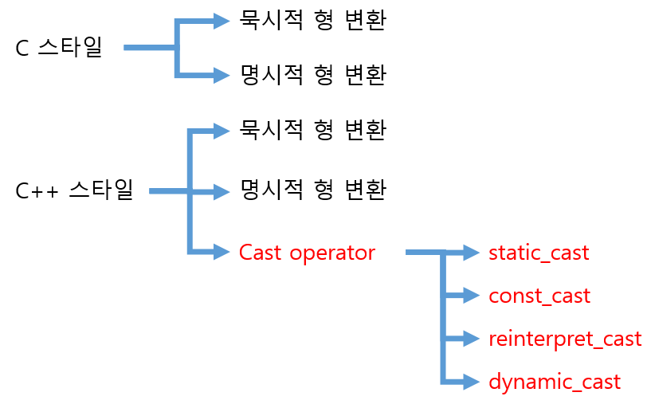

# 타입 변환(Type Casting)
> 변수의 Type을 강제로 다른 Type으로 변경하는 것

<br>

### ***타입 변환은 왜 필요할까?***
> 외부 라이브러리 사용시 인자로 넘길 변수의 타입이 맞지 않을 때 타입 변환을 통해 타입을 맞춰주어야 한다

<br>

### 값 타입 변환
> 의미를 유지하기 위해서 사용되며 원본 객체와 다른 비트열로 재구성하는 것

<br>

``` cpp
int a = 123456789;
float b = (float)a;       // 부동소수점(지수 + 유효숫자)
```
 * 정수를 부동소수점으로 표현하기 위해 최대한 근접한 값으로 비트열을 재구성하여 값이 약간 다를 수 있다

<br>

### 안전한 타입 변환
> 의미가 항상 100% 완전히 일치하는 경우

 * `업캐스팅`: 같은 타입이면서 크기가 큰 타입으로의 변환
 * ex) char -> short, short -> int, int ->  __int64 

<br>

### 불안전한 타입 변환
> 의미가 항상 100% 일치한다고 보장하지 못하는 경우

 * `다운캐스팅`: 같은 타입이지만 크기가 작은 타입으로의 변환
 * ex) float -> int, int -> short

<br>

### 참조 타입 변환
> 비트열을 재구성하지 않고 `관점`만 바꾸는 것

 * 거의 쓸 일은 없지만 포인터 타입 변환도 참조 타입 변환과 동일한 룰을 따른다

<br>

``` cpp
int a = 123456789;
float b = (float &)a;       // 부동소수점(지수 + 유효숫자)
```
 * 데이터는 유지되지만 의미는 변질된다

---
<br>

## 타입 변환의 종류

<br>



<br>


### 1. 암시적(묵시적) 형 변환
> 이미 알려진 타입 변환 규칙에 따라서 컴파일러가 자동으로 타입을 변환한다

<br>

``` cpp
float a = 3.14;
int b = a;        // b = (int)a 으로 명시적 형 변환 발생
```

<br>

### 2. 명시적 형 변환 
> 개발자가 변환할 타입을 명시해주는 것

``` cpp
float a = 3.14;
int b = (int)a;    // 명시적 형 변환

// 명시적 형 변환 예시
void Print(unsigned char * str)
{
    cout << str << endl;
}

char str[20] = "Hello World"
Print((unsigned char*) str);   // 명시적 형 변환
```
 * 대표적으로 함수의 인자와 매개변수 타입이 다를 경우 사용

---
<br>


## 포인터의 타입 변환

<br>

```cpp
class Item
{
public:
    Item()
    {
        cout << "Item()" << endl;
    }
    Itme(int itemType) : _itemType(itemType)
    {

    }
    Item(const Item& item)
    {
        cout << "Item(const Item&)" << endl;
    }
    ~Item()
    {
        cout << "~Item()" << endl;
    }
public:
    int _itemType = 0;
    int _itemDbId = 0;

    char _dummy[4096] = {};
};

eunm ItemType
{
    IT_WEAPON = 1,
    IT_ARMOR = 2
}


class Weapon : pulbi Item
{
public:
    Weapon() : Item(IT_WEAPON)
    {
        cout << "Weapon()" << endl;
    }
    ~WeaPon()
    {
        cout << "~Weapon()" << endl;
    }
public:
    int _damamge = 0;
};

class Armor : public Item
{
public:
    Weapon() : Item(IT_ARMOR)
    {
        cout << "Armor()" << endl;
    }
    ~WeaPon()
    {
        cout << "~Armor()" << endl;
    }
public:
    int _defence = 0;
};

// 부모 -> 자식 형 변환
Item* item = new Item();   // Item 클래스 동적 할당

Weapon* weaopn = (Weapon *)item; // Weapon 포인터형 타입으로 형 변환

delete item;

// 자식 -> 부모 형 변환
Weapon * weapon = new Weapon();

Item * item = weapon;        // 암시적 형변환 

delete weapon;
```    
 
<br>

1. 부모 클래스 -> 자식 클래스 형 변환
 * 암시적 형 변환 불가능
 * 메모리 크기가 작은 것에서 큰 것으로 타입 변환은 위험하다
 * 명시적 타입 변환은 항상 조심해야 한다

<br>

2. 자식 클래스 -> 부모 클래스 형 변환 
 * 암시적 형 변환 가능

<br>

### ***그렇다면 명시적 타입 변환이 위험하다면 암시적 타입 변환만 사용하면 되는거 아닐까 ?***

<br>


